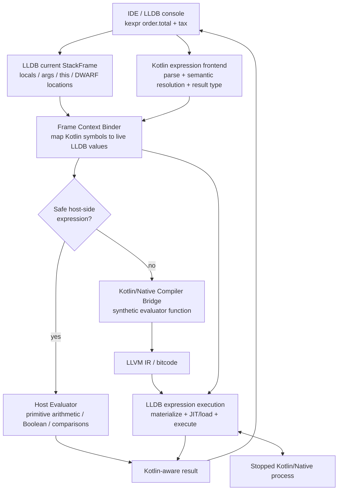

# Kotlin/Native Expression Evaluation for LLDB

A focused research prototype for adding **Kotlin expression evaluation** to LLDB while debugging Kotlin/Native programs.

Kotlin/Native already emits DWARF debug information that LLDB can use for breakpoints, stepping, and variable inspection. The missing feature is Kotlin-language expression evaluation in the debugger.

> Project status: **Phase 1 is implemented as an LLDB Python proof of concept for primitive/local expressions.**  
> The compiler-backed Kotlin/Native path is an architecture proposal and implementation plan, not yet a finished production plugin.

## Problem

At a Kotlin/Native breakpoint, LLDB can inspect values, but expressions such as:

```kotlin
x + y * factor
enabled && count < max
order.total + tax
customer?.address?.city
```

need Kotlin-aware parsing, name/type resolution, and—when full Kotlin semantics are required—Kotlin/Native code generation.

The goal of this project is to bridge that gap.

## Architecture



## Phase 1: proof of concept

The repository includes an LLDB Python command named `kexpr`.

It:

1. reads the selected LLDB frame,
2. captures primitive locals/arguments through `SBFrame` / `SBValue`,
3. parses a restricted Kotlin-like expression,
4. evaluates it safely on the debugger host.

Supported in the current PoC:

- integer-like locals
- floating-point locals
- Boolean locals
- `+ - * / %`
- `== != < <= > >=`
- `&& || !`
- parentheses

Example:

```text
(lldb) kexpr x + y * factor
24

(lldb) kexpr x > 5 && enabled
true
```

This phase proves the debugger data path without injecting code into the target.

## Quick start

### 1. Build a Kotlin/Native debug executable

Use the sample in `sample/Main.kt` and build it with debug information using your Kotlin/Native toolchain.

### 2. Start LLDB

```bash
lldb ./build/sample.kexe
```

### 3. Load the command

From LLDB:

```text
command script import /absolute/path/to/poc/lldb_kexpr.py
```

You should see:

```text
Installed commands: kexpr, kexpr-vars
```

### 4. Break where the sample variables are in scope

```text
(lldb) breakpoint set --file Main.kt --line 5
(lldb) run
```

### 5. Evaluate

```text
(lldb) kexpr x + y * factor
(lldb) kexpr x > 5 && enabled
```

## Why not use LLDB's normal `expr` directly?

Expression evaluation in LLDB is language-specific.

A Kotlin expression such as:

```kotlin
customer?.profile?.name ?: "unknown"
```

requires Kotlin syntax and Kotlin semantic rules. A C/C++ expression parser cannot provide those semantics.

The missing pipeline is:

```text
Kotlin syntax
    +
Kotlin semantic resolution
    +
current-frame symbol binding
    +
Kotlin/Native lowering
    +
LLDB target execution
```

## Full Kotlin path

For a complex expression:

```kotlin
order.total + tax
```

the proposed compiler-backed path is:

```text
1. Parse the expression as a Kotlin code fragment.
2. Resolve `order`, `order.total`, and `tax` in the stopped source context.
3. Read the live frame locations/values from LLDB.
4. Generate a synthetic evaluator:

   fun __lldb_eval(order: Order, tax: Double): Double {
       return order.total + tax
   }

5. Lower the evaluator with a Kotlin/Native compiler bridge.
6. Produce LLVM IR/bitcode.
7. Materialize the current frame values into the evaluator.
8. Execute the generated code through LLDB's expression/JIT infrastructure.
9. Convert the returned native value back to a Kotlin debugger value.
```

## Proposed LLDB integration

LLDB's language-support architecture provides the right extension points for this design.

```text
Kotlin TypeSystem
      |
      +--> KotlinUserExpression
              |
              +--> KotlinExpressionParser
                      |
                      +--> Kotlin semantic frontend
                      +--> Kotlin/Native compiler bridge
                      +--> LLVM IR
                              |
                              +--> LLDB execution
```

A production implementation would integrate with LLDB's C++ APIs rather than keeping the hot path in Python.

## Kotlin semantic frontend

The Kotlin Analysis API can provide semantic information such as:

- resolved symbols
- expression types
- call resolution
- nullability
- diagnostics

Kotlin code fragments are useful for analyzing an expression in an existing source context.

However, the currently documented in-memory Analysis API compilation target is JVM. Native expression code generation therefore needs a **Kotlin/Native compiler bridge** or a version-pinned compiler service rather than assuming the public Analysis API can directly emit native code.

## Frame context binding

This is a central part of the design.

The compiler sees:

```text
name: order
type: Order
```

LLDB sees:

```text
current runtime location/value for `order`
```

The bridge joins them.

Conceptually:

```cpp
struct CapturedValue {
    std::string kotlinName;
    std::string kotlinType;
    lldb::ValueObjectSP value;
    lldb::addr_t address;
    bool addressable;
};
```

These captured values become synthetic inputs to the generated evaluator.

## Performance strategy

A high-performance implementation should:

- keep primitive/pure expressions on the host fast path,
- keep a warm Kotlin compiler service instead of launching the compiler for every watch refresh,
- cache parsed/typed expression plans,
- cache symbol/type/runtime-layout metadata,
- lazily render objects and collection children,
- batch LLDB memory reads, especially for remote targets,
- use cancellable and time-limited evaluation,
- key caches by source location, expression text, compiler version, and loaded modules.

## Safety

Target-side evaluation may have side effects.

A production debugger should distinguish:

**Safe mode**

- reads
- arithmetic
- comparisons
- selected pure operations

**Full mode**

- function calls
- assignments
- mutation
- runtime calls

Full mode should use an explicit user action and enforce cancellation/timeout handling.

## Repository layout

```text
.
├── README.md
├── LICENSE
├── docs/
│   ├── ARCHITECTURE.md
│   ├── IMPLEMENTATION_PLAN.md
│   └── REFERENCES.md
├── poc/
│   ├── kexpr_core.py
│   └── lldb_kexpr.py
├── sample/
│   └── Main.kt
├── tests/
│   └── test_kexpr_core.py
└── .github/workflows/
    └── tests.yml
```

## Run the evaluator unit tests

```bash
python3 -m unittest discover -s tests -v
```

## Next milestone

The next technical milestone is:

> **Resolve a real Kotlin code fragment against source context, bind its free variables to an LLDB frame, and emit a native evaluator function through the Kotlin/Native backend.**

That is the bridge required to move from the Phase-1 primitive evaluator to real Kotlin expression support.

## References

See [`docs/REFERENCES.md`](docs/REFERENCES.md).
