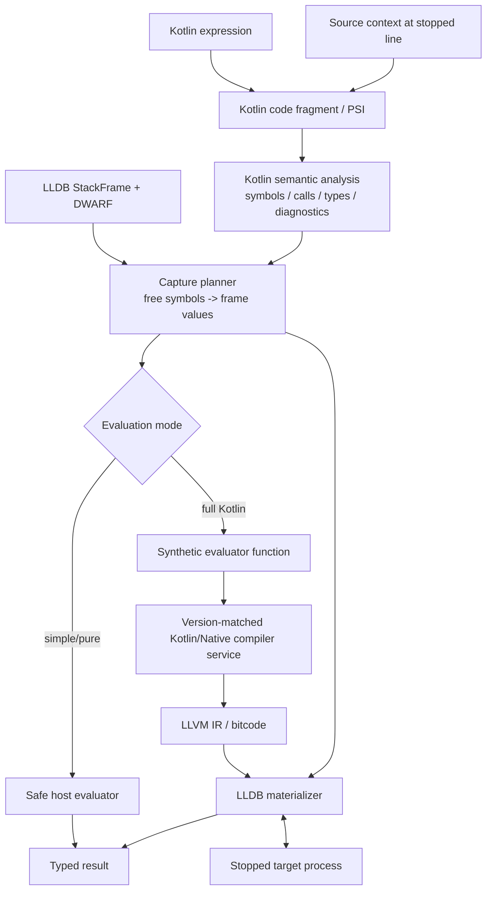

# Architecture

## Production direction



## Recommended compiler boundary

```text
LLDB plugin / debugger core (C++)
            |
            | IPC
            v
Kotlin Expression Compiler Service
            |
            +-- K2 / Analysis API semantic resolution
            +-- Kotlin/Native backend
            +-- compiler-version-specific runtime knowledge
            |
            v
LLVM IR / bitcode + result metadata
```

## Frame binding

For:

```kotlin
order.total + tax
```

semantic analysis identifies the source-level symbols and types, while LLDB owns the live values/locations. The capture planner maps the two representations.

## LLDB integration direction

LLDB documents language-specific expression evaluation as part of a `TypeSystem` implementation. A Kotlin production path would conceptually use:

```text
TypeSystem
  -> UserExpression
       -> ExpressionParser
            -> Kotlin compiler bridge
                 -> generated LLVM IR
                      -> LLDB execution
```

Exact C++ signatures must be matched to the LLDB version being integrated.

## Version compatibility

Compiler-backed evaluation must be version-aware. The Kotlin/Native compiler/runtime internals should not be treated as a stable debugger ABI.
